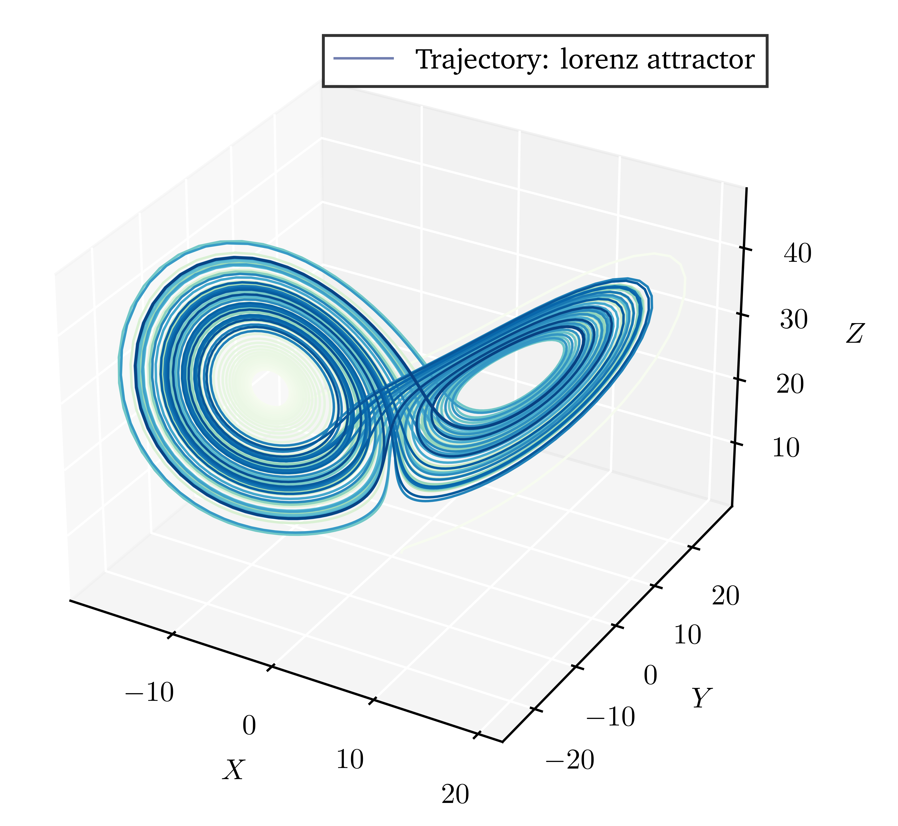

<h1 align="center">PHQ-404 Méthodes numériques et simulations</h1>

<div align="center">
  
  
</div>

<br />

<div align="center">
  Ce dépôt est essentiellement le contenu du cours de simulation et méthodes numériques de l'Université de Sherbrooke (PHQ-404) c.-à.-d. la solution aux devoirs, le projet final ainsi que les notes de cours.
</div>

<br />

<div align="center">
  
  <a href=""></a>
  <a href=""></a>
  
</div>

### Description des fichiers

#### `./PHQ404_devoirs/`

Contient les dépôts des 4 devoirs résolus pour le cours.

#### `./attractors/`

Contient le projet final concernant la caractérisation des attracteurs chaotiques. Celui-ci est
écrit en Python et requiert l'utilisation de `poetry` pour la gestion de librairies.

#### `./PHQ404_2022.pdf`

Les notes de cours de David Sénéchal sur les méthodes numériques et simulations.

## Requirements

L'utilisation de ce projet via le programme `poetry` est fortement encouragée.
Il est toutefois obligatoire d'avoir une version du programme plus élevée que
1.1.13 pour la compatibilité des fichiers de configuration. Pour synchroniser
les dépendances nécessaires et fabriquer votre propre environnement virtuel à
l'aide de cet outil la commande

```shell
poetry install
```

executée à la racine du projet présent dans le dossier `attractors/` devrait suffire.
